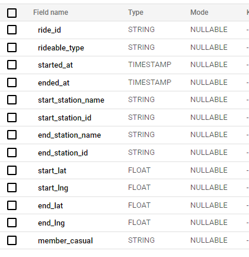
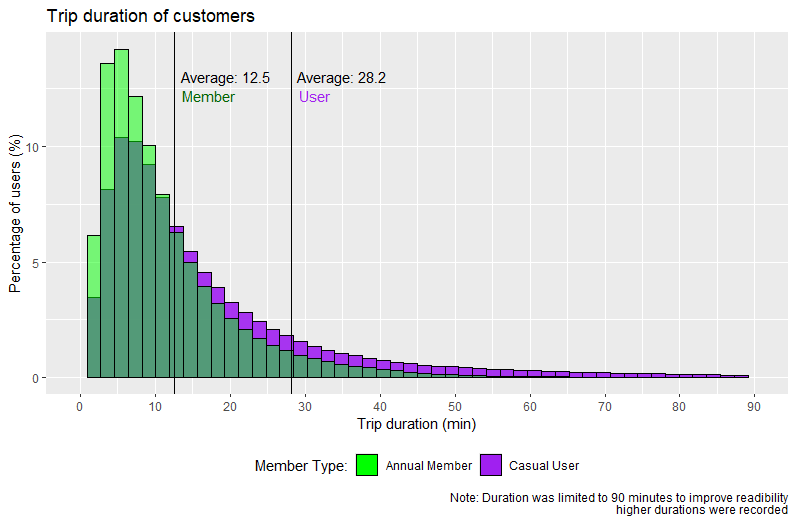
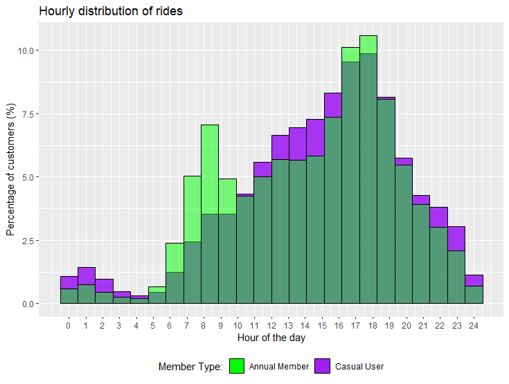
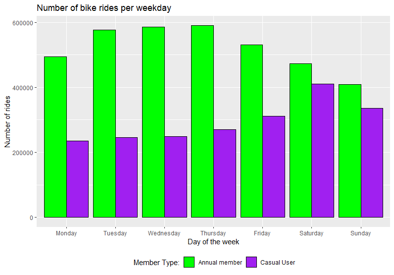
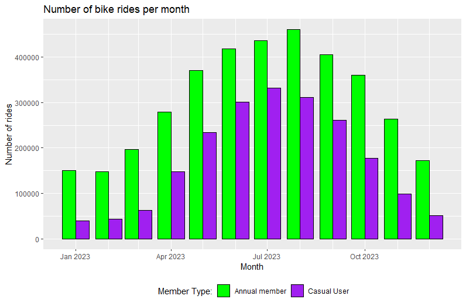
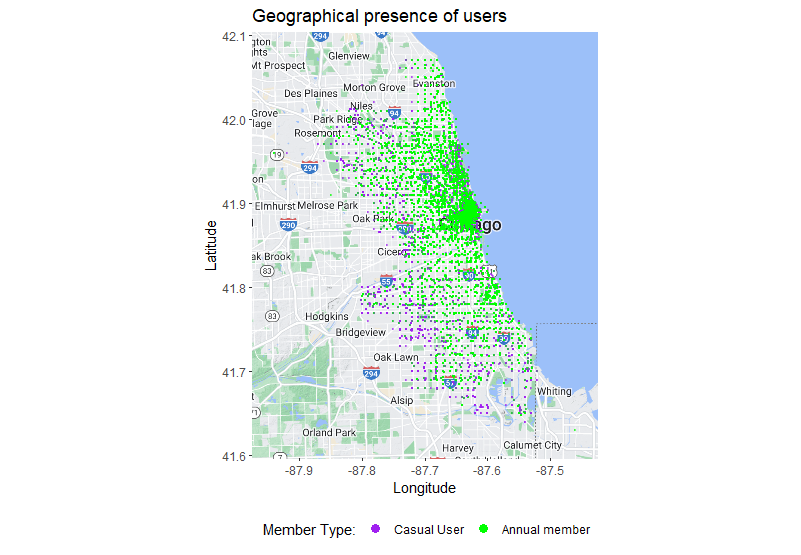

Cyclistic bike-share Analysis
================
Miguel Soares
2024-04-21

### Introduction

Cyclistic is a *fictional* bike-sharing service founded in 2016,
currently it has grown to a fleet of nearly 6000 bikes and close to 700
stations placed throughout Chicago, IL. Up until now Cyclistics
marketing strategy relied on its flexible payment plans, that allowed
customers to pick-and-chose hte type of experience they desired.

This payment plan categorized customers under the following:

- **Casual users** - pay-per-ride/day plan  
- **Annual members** - annual subscription allowing unlimited use of
  bicycles and other perks

Having concluded that the brand’s reach has increased sufficiently and
that annual members are substantialy more profitable compared to casual
users, the director of marketing believes that converting the casual
user-base, who already has a history with the service, will be key for
future growth.

As such a new goal has been established, design marketing strategies
aimed at converting casual riders into annual members. However, in order
to do that, the team needs to better understand how both types differ
from one another and what could motivate casual users to buy a
membership.

Note:  
*Data used belongs to the City of Chicago’s bike sharing service Divvy,
operated by Lyft Bikes and Scooters, LLC, and is publicly published
under the following
[licence](https://divvybikes.com/data-license-agreement) on this
[link](https://divvy-tripdata.s3.amazonaws.com/index.html). This
data-set is composed of historical, first-party data gathered from the
beginning of 2014 until the present, published quarterly up to the first
quarter of 2020 and monthly thereafter.*

### Business Task

Preform an exploratory data analysis (EDA) on the customer base &
consumer habits of casual and annual membership users.  
Identify key differences and potential opportunities to influence
customers into upgrading their subscription plan.

### Innitial Hypothesis

The initial hypothesis regarding the distinct characteristics of both
customer types are the following:

**Annual members**

- Use bicycles to commute:
  - Short trips  
  - Nº rides constant throughout the weekdays  
  - Average nº rides stable throughout the year

**Casual users**

- Use bicycles for leisure:
  - Longer trips  
  - Higher ride frequency during weekends
  - Highly seasonal, tending towards spring & summer

### Data Cleaning

Data analyzed (from beginning to end of 2023), due to size limitations,
was stored in the data warehouse [BigQuery](https://cloud.google.com/)
and was queried through a Structure Query Language (SQL). <br>

#### Looking at the data

The data directly gathered has the following attributes:

- **ride_id**: The primary-key identifying individual trips.  
- **rideable_type**: The type of bicycle used (classic/electric).  
- **started_at**: The moment when the trip started (DATE-TIME).  
- **ended_at**: The moment when the trip ended (DATE-TIME).  
- **start_station_name**: The name of the starting station.  
- **start_station_id**: The foreign-key identifying the starting
  station.  
- **end_station_name**: The name of the ending station.  
- **end_station_id**: The foreign-key identifying the ending station.  
- **start_lat**: The latitude at the start of the trip.
- **start_lng**: The longitude at the start of the trip.
- **end_lat**: The latitude at the end of the trip.
- **end_lng**: The longitude at the end of the trip.
- **member_casual**: The type of customer (casual/member).

 <br>

#### Checking for duplicate information
``` sql
SELECT 
  COUNT(DISTINCT ride_id) AS number_of_distinct_rides  
FROM
  database
```
<br> Results in a total 5719877 entries \> no individual trips were
logged multiple times.  
<br>

#### Checking for geographical outliers
``` sql
SELECT
  MIN(start_lat) AS minimum_latitude,
  MAX(start_lat) AS maximum_latitude,
  MIN(start_lng) AS minimum_longitude,
  MAX(start_lng) AS minimum_latitude,
FROM
  database
```
<br> All starting and ending coordinates inside expected range: Chicago
-\> latitude ∈ \[41.75±0.25\], longitude ∈ \[-87.75±0.25\]  
<br>

#### Checking for incongruencies in the trips start and end dates/times
``` sql
SELECT
  DATETIME_DIFF(ended_at,started_at, second) AS trip_duration # Calculates the difference between the trip’s end and start times
FROM
  database
ORDER BY
  trip_duration ASC
```

<br> Discrepancy observed, **272** start dates occur after their
respective end dates and need to be fixed!  
<br>

#### Checking Redundant information and Data types

Station names and ids were deemed redundant as geographical coordinates
are available, similarly end station coordinates were disregarded in
order to simplify geographical marking of starting stations.  
<br> Data types were checked by analyzing the database schema:

- ride_id: STRING  
- rideable_type: STRING  
- started_at: TIMESTAMP  
- ended_at: TIMESTAMP  
- start_lat: FLOAT  
- start_lng: FLOAT  
- member_casual: STRING  
  <br>

#### Checking for missing values
``` sql
SELECT *
FROM
  database
WHERE
  ride_id IS NULL
  OR rideable_type IS NULL
  OR started_at IS NULL
  OR ended_at IS NULL
  OR start_lat IS NULL
  OR start_lng IS NULL
  OR member_casual IS NULL
```
<br> All relevant columns presented no missing values.  
<br>

#### Creating the cleaned table
``` sql
SELECT
  ride_id,
  rideable_type,
  CASE # Switches start-end when needed
    WHEN started_at <= ended_at THEN started_at
    WHEN started_at > ended_at THEN ended_at
  END AS start_datetime,
  CASE # Switches start-end when needed
    WHEN started_at <= ended_at THEN ended_at
    WHEN started_at > ended_at THEN started_at
  END AS end_datetime,
  DATETIME_DIFF(ended_at,started_at, second) AS trip_duration # Adds a new column
  start_lat,
  start_lng,
  member_casual
FROM
  database
ORDER BY
  start_datetime
```
### Data Exploration

This data-set allows for the exploration of three main components when
in regards to differences in behavior of casual users and annual
membership holders, with them being:

- **Date & time** each bicycle trip was started and its **duration**  
- **Where** each trip started  
- What was the **type** of bike used  
  <br>

#### Date & Time - Trip Duration

``` r
duration_casual <- duration_data %>% filter(member_casual=="casual")
duration_member <- duration_data %>% filter(member_casual=="member")
average_casual <- duration_casual %>% summarize(mean(trip_minutes))
average_member <- duration_member %>% summarize(mean(trip_minutes))


ggplot()+
geom_histogram(data=duration_casual,mapping=aes(x=trip_minutes,
                                               y = (after_stat(count))/sum(after_stat(count))*100,
                                               fill="purple"),bins=50,alpha=0.9,color="black")+
geom_histogram(data=duration_member,mapping=aes(x=trip_minutes,
                                               y = (after_stat(count))/sum(after_stat(count))*100,
                                               fill="green"),bins=50,alpha=0.5,color="black")+
geom_vline(aes(xintercept = mean(duration_casual$trip_minutes)),size=0.5)+
geom_vline(aes(xintercept = mean(duration_member$trip_minutes)),size=0.5)+
scale_x_continuous(breaks=c(0:15)*10, limits=c(0,90))+
scale_fill_identity(name = 'Member Type:',
                    guide = 'legend',
                    labels = c("Annual Member","Casual User"))+
guides(fill = guide_legend(override.aes = list(alpha = 1)))+
labs(title = "Trip duration of customers",
     x = "Trip duration (min)",
     y = "Percentage of users (%)",
     caption="Note: Duration was limited to 90 minutes to improve readibility\nhigher durations were recorded")+
theme(legend.position="bottom")+
annotate("text",x=20.5,y=13,label=substr(paste("Average:",average_member),1,13),color="black")+
annotate("text",x=18,y=12.2,label="Member ",color="darkgreen")+
annotate("text",x=36,y=13,label=substr(paste("Average:",average_casual),1,13),color="black")+
annotate("text",x=33.5,y=12.2,label="User      ",color="purple")
```

 <br> By overlapping the trip duration
histogram of both customer types, we quickly determine how Annual
members show a significant tendency towards shorter trips, more than
halving average ride duration when compared to the more casual users.  
<br>

#### Date & Time - Hours of the day

Due to computation limitations with RStudio and big packets of data,
time of day data was first extracted through the use of python’s library
*pandas*.

``` python
import pandas as pd

test_df = pd.read_csv('start_datetime_usertype.csv')

#Creating the structure for the data frames
casual_data={'start_datetime':0}
casual_list=list()
member_data={'start_datetime':0}
member_list=list()

#Iterating through the data
for i in range(len(test_df['start_datetime'])):
    
    time = test_df['start_datetime'][i].split()[1].split(':')   #datetime->["HH","MM","SS"] ex) ["06","32","04"]
    time2= [str(int(x)) for x in time]                          #removes 0s -> ex) ["6","32","4"]
    time3 = ' '.join([time2[0]+"H",time2[1]+"M",time2[2]+"S"])  #adds the "H","M","S"
    
    if test_df['member_casual'][i] == 'casual':
        casual_list += [time3]
    elif test_df['member_casual'][i] == 'member':
        member_list += [time3]

#Updating the dataframes with converted data
casual_data['start_datetime']=casual_list
casual_df=pd.DataFrame(casual_data,columns=['start_datetime'])

member_data['start_datetime']=member_list
member_df=pd.DataFrame(member_data,columns=['start_datetime'])

#Exporting the dataframes
casual_df.to_csv('casual_hour.csv')
member_df.to_csv('member_hour.csv')
```

<br> Which now allows us to use R to create the visualization:

``` r
start_casual <- read.csv("casual_hour.csv")
start_member <- read.csv("member_hour.csv")

ggplot()+
geom_histogram(data=start_casual,mapping=aes(x=hms(start_datetime),
                                             y = (after_stat(count))/sum(after_stat(count))*100,
                                             fill="purple"),bins=24,alpha=0.9,color="black")+
geom_histogram(data=start_member,mapping=aes(x=hms(start_datetime),
                                             y = (after_stat(count))/sum(after_stat(count))*100,
                                             fill="green"),bins=24,alpha=0.5,color="black")+
scale_x_time(breaks=c(0:24)*3600,labels=as.character(c(0:24)))+
scale_fill_identity(name = 'Member Type:',
                    guide = 'legend',
                    labels = c("Annual Member","Casual User"))+
guides(fill = guide_legend(override.aes = list(alpha = 1)))+  
labs(title = "Hourly distribution of rides", x = "Hour of the day", y = "Percentage of customers (%)")+
theme(legend.position="bottom")
```

 <br> A significant increase through the day
can be seen in both customer types, peaking at 5 to 6 p.m. (end of work
hours) and quickly declining afterwards. Annual member behavior
distinguishes itself by having a higher primary peak and a secondary
peak at 7 to 8 a.m. but lower levels outside of the rush timezone. <br>

#### Date & Time - Days of the week

``` r
weekday_data <- read.csv("start_datetime_usertype.csv")%>% mutate(weekday=weekdays(as_date(start_datetime)))

working_df <- weekday_data
#View(working_df)

#Changing factor levels to order the week day columns and the legend
working_df$weekday<-factor(working_df$weekday,
                                levels=c("Monday","Tuesday","Wednesday","Thursday","Friday","Saturday","Sunday"))
working_df$member_casual<-factor(working_df$member_casual,
                                levels=c("member","casual"))

options(scipen = 999) #Changes the bias in printing integers in scientific notation

ggplot()+
  geom_bar(data=working_df,
           mapping=aes(x=weekday,
                       fill=member_casual),
           position="dodge",
           color="black")+
  scale_fill_manual(name = " Member Type:",
                      labels = c(casual="Casual User",member="Annual member"),
                      values = c(casual="purple",member="green"))+
  labs(title="Number of bike rides per weekday",
       x="Day of the week",
       y="Number of rides")+
  theme(legend.position="bottom")
```

 <br> While casual users seem to prefer going on
bicycle rides during friday and the weekend, annual members actually
have their highest activity during the weekdays, with a significant
drop-off nearing the end of the week. <br>

#### Date & Time - Seasonality

``` r
date_data <- read.csv("start_datetime_usertype.csv")%>%
  mutate(date=format(as.Date(start_datetime),"%m/%Y"))

#View(date_data)

working_df <- date_data %>% group_by(member_casual,date) %>% select(member_casual,date) %>% summarise(rides=n())
View(working_df)

#Boundaries betwwen least and highest customer months
min_max = data.frame(casual=c(working_df$rides[1],working_df$rides[7]),member=c(working_df$rides[13],working_df$rides[20]))

#Changing factor levels to order the legend
working_df$member_casual<-factor(working_df$member_casual,
                                 levels=c("member","casual"))

options(scipen = 999) #Changes the bias in printing integers in scientific notation

ggplot()+
  geom_col(data=working_df,
           mapping=aes(x=my(date),
                       y=rides,
                       fill=member_casual),
           position="dodge",
           color="black")+
  scale_x_date(date_minor_breaks="1 month")+
  scale_fill_manual(name = " Member Type:",
                    labels = c(casual="Casual User",member="Annual member"),
                    values = c(casual="purple",member="green"))+
  labs(title="Number of bike rides per month",
       x="Month",
       y="Number of rides")+
  theme(legend.position="bottom")
```

  
<br>

Although both customer types demonstrate a similar behavior, when
showcasing a preference towards the warmer seasons, with a significant
fall-off during autumn and a stagnation during winter. The seasonality
shown by casual users is significantly greater, with the difference
between their lowest and highest activity month being of **728%**,
comparing to the **206%** difference found with annual members.  
<br>

#### Geography - Starting locations

The dispersion of customers throughout the city of Chicago can be a
strong starting point to show the current focus of our different
customer types and possible points of weakness of the distribution
network currently available.

``` r
location_data <- read.csv("lat_long_usertype.csv")
View(location_data)

c_map <- get_map("Chicago",zoom=10)

ggmap(c_map) +
  geom_point(data = location_data, mapping = 
               aes(x = start_lng, y = start_lat, color = member_casual),position = "jitter",size = 1/10, alpha = 0.5) +
  scale_color_manual(name = " Member Type:",
                     labels = c("Casual User","Annual member"),
                     values = c(casual = "purple", member="green")) +
  scale_x_continuous(limits = c(-87.95, -87.45)) + 
  scale_y_continuous(limits = c(41.62, 42.08)) +
  labs(title = "Geographical presence of users", x = "Longitude", y = "Latitude")+
  guides(color = guide_legend(override.aes = list(alpha = 1,size=3)))+
  theme(legend.position="bottom",legend.key =element_rect(fill="transparent"))
```

 <br> As can be seen there is a
significant focus of the annual members in downtown Chicago, more
specifically the Chicago Loop, Near West & North side and Lincoln Park,
some of the most populated residential and business districts, whereas
casual users are more evenly dispersed throughout the city.  
<br>

#### Bicycle type

``` r
bike_data <- read.csv("bike_type_usertype.csv")

working_df <- bike_data 

classic_bike <- working_df %>% filter(rideable_type=="classic_bike")
electric_bike <- working_df %>% filter(rideable_type=="electric_bike")
View(classic_bike)

#Changing factor levels to order the legend
classic_bike$member_casual<-factor(classic_bike$member_casual,levels=c("member","casual"))
electric_bike$member_casual<-factor(electric_bike$member_casual,levels=c("member","casual"))

ggplot()+
  geom_bar(data=classic_bike,
           mapping=aes(x=rideable_type,
                       
                       fill=member_casual),
           position="dodge",
           width=0.5,
           color="black")+
  geom_bar(data=electric_bike,
           mapping=aes(x=rideable_type,
                       
                       fill=member_casual),
           position="dodge",
           width=0.5,
           color="black")+
  scale_fill_manual(name = " Member Type:",
                    labels = c(casual="Casual User",member="Annual member"),
                    values = c(casual="purple",member="green"))+
  scale_x_discrete(labels=c("Classic","Electric"))+
  labs(title="Difference between customer usage of differing bicycle types",
       x="Type of bicycle",
       y="Number of rides")+
  theme(legend.position="bottom")
```

 Annual members display a 50/50
propensity when considering bicycle type to use, while casual users show
a preliminary tendency towards electric bicycles.

More data would be needed regarding current bicycle type spread
throughout Chicago to further analyze customer preference over one or
the other as anything other that a 50/50 split would skew the total
number of rides and introduce bias. <br>

### Conclusions

- **Annual Members:** From their lower average ride durations, low
  interest in biking outside of the usual work rush hours, in
  conjunction with overall number of rides dropping during the weekend
  and a tight spread in the most populated areas Annual members are in
  essence commuters who have chosen shareable bicycles as their mode of
  transportation, mostly relying on the service to get from A to B
  instead of going on leisure trips, taking less into account the
  ease/comfort of the ride.  
  <br>
- **Casual Users:** In opposition, Casual users rely on the service
  mostly to go on joyrides, averaging longer rides outside of work-hours
  and showing a high seasonality dependance. These users are most
  interested in their comfort and enjoyment, preferring warmer seasons
  and electric bycicles.

### Recomendations going forwards

The main focus when converting the more casual users of the present into
the annual membership holders of the future relies on our capacity to
influence the development of systematic habits. Currently users don’t
see Cyclicist as a mode-of-transportation but as a hobby and as such the
recommendations proposed were aligned to support this shift in paradigm.
<br>

**1st - Analysis of Supporting Infrastructure:**

    - Do we have plans to, or are we currently able to handle an
increase in bicycle usage, especially in high circulation areas like
downtown Chicago? (additional information and analysis would be required
looking into the current state of all stations & bicycles, estimated
maintenance, mileage, ride frequency, etc)

<br>

**2nd - Marketing Campaigns:**

  - An “early ‘rider’” campaign promoting the use of bicycles to casual
users targeted towards the 6-9 a.m. range

  - Advertising/promotion campaigns during early spring and throughout
summer, attracting the more casual users when they start to consider
alternative methods of transportation.

<br>

**3rd - Upgrade Bicycles**

  - Consider slowly shifting towards a mostly electric bicycle based
service as they are more popular between both audiences, especially
casual users.

<br>
